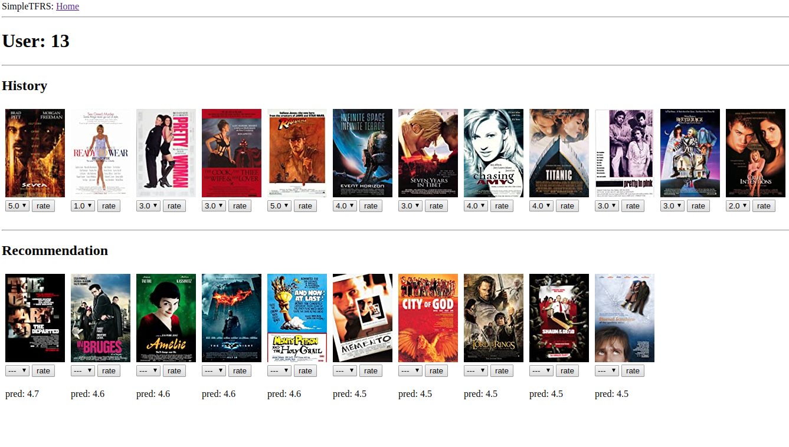
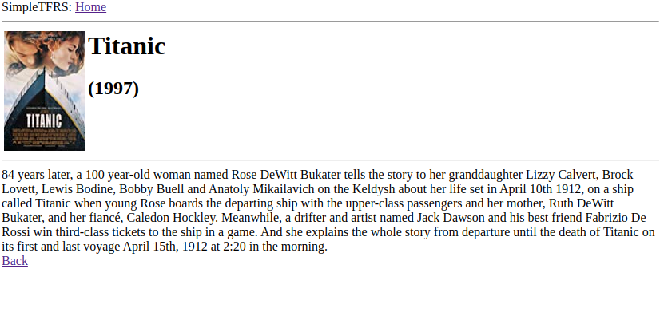

# tfrs-movierec-serving

This repository contains movie recommendation systems using [tensorflow-recommenders](https://github.com/tensorflow/recommenders)(tfrs) which is a library for building recommender system models using tensorflow. 
- The code is based on Tensorflow and keras, but designed to be modular and scalable.
- For experiment management, we use 'Weight & Biases' for training, parameter search, and storing model.
- We also use 'Annoy' to build an Approximate Nearest Neighbor (ANN) index to export for efficient candidate retireval.
- The recommender systems are packaged as a REST API.
- This repository also contains a minimal implementation of local web server where users can rate recommended movies as well as check his/her movie history and information of those movies. 

## Setup

- If you don't have the repo in your box, open a terminal and run
```sh
git clone https://github.com/hojinYang/tfrs-movierec-serving.git
cd tfrs-movierec-serving
```
- To set up the Python environment, simply run ```pip install -r requirements.txt```. I would recommend to use virtual environment(e.g. conda, venv) with python 3.7. If that line didn't work, you may need to manually install some of packages using pip or conda. 
- Also, two main directories(webserver and recommenders) are needed to be add to PYTHONPATH, or or you will get errors like ```ModuleNotFoundError: No module named 'recommenders'```. Run
```sh
PYTHONPATH= "your/dir/tfrs-movierec-serving/webserver:your/dir/tfrs-movierec-serving/recommenders:$PYTHONPATH"
export PYTHONPATH
```
before executing any commands later on, or add those lines to ```.bashrc``` if you want to add them permanently.

## Recommenders
In general, the recommendation system consists of two stages: retrieval and ranking. The retrieval phase serves to select an initial set of hundreds of candidates from all possible items. The ranking model takes the output of the retrieval model and fine-tune it to increase recommendation quality. This repository contains tfrs-based retrieval and ranking models. We also use [Annoy](https://github.com/spotify/annoy) to build an [Approximate Nearest Neighbor](https://towardsdatascience.com/comprehensive-guide-to-approximate-nearest-neighbors-algorithms-8b94f057d6b6) (ANN) index to export for efficient candidate retireval.

For now this repository contains MF network for retrieval and NCF-style network for ranking model, though you can define your custom networks in ```recommenders/networks```. There are warpper classes called Retireval model and Ranking model in ```recommenders/models```. When training model, (custom) networks are plugged in these classes which support loss function and evaluation metric.   

For experiment management, we use [Weight & Bias](https://www.wandb.com/) (W&B). W&B is an experiment tracking tool that ensures you never lose track of your progress. Especially, W&B provides built in support for running sweeps, which enable automated trials of hyper-parameters. W&B is cloud-based system, thus you can easily share your logs with others online. 

- [Retrieval model W&B sweep tracking](https://wandb.ai/hojinyang/uncategorized/sweeps/dzkcun2a?workspace=user-)
- [Ranking model W&B sweep tracking](https://wandb.ai/hojinyang/uncategorized/sweeps/9otkw5ct?workspace=user-)

To run retrieval sweep, run
```sh
cd recommenders
wandb sweep train/sweep_retrieval_model.yml
# wandb will give you a sweep id
wandb agent your/sweep/id
```
Please check W&B's tutorial on [sign-up](https://docs.wandb.com/quickstart) and [sweep](https://docs.wandb.com/sweeps) if you are not familiar with W&B. If you are interested in training model in parallel, check [ray](https://ray.io/) which supports distributed training on top of W&B.

## Web Server
This repository also contains a minimal web server implementation using Flask and SQLite. The database was initialized using 'movielens-latest-small', and we use [IMDbPy](https://github.com/alberanid/imdbpy) to get additional information about the movie. This repository already contains the database(app.db)), although you can initialize it by yourself by running ```python utils/add_movielens_to_db.py```.

To start the server on your local host, run

```sh
cd webserver
flask run
```
You also need to run recommenders local api server to generate recommendations. Open another shell and run

```sh
cd recommenders
python api/api.py
```

| User page                |  Movie page |
|:-------------------------:|:-------------------------:|
|        | |

## Acknowledgement
We referred to the directory structure of [full-stack deep-learning](https://github.com/full-stack-deep-learning/fsdl-text-recognizer) project repo when designing our recommenders library. We also borrowed a few utility functions for W&B sweep from fsdl repo.  